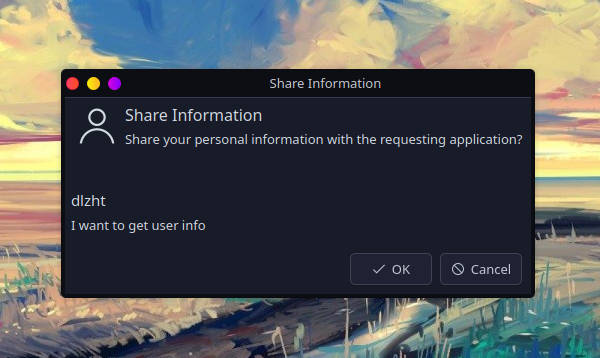

### XDG Desktop Portal

XDG Desktop Portal allow Flatpak apps, and other desktop containment frameworks, to interact with the system in a secure and well defined way.

### Features

|                       | impl | example | version    | doc                                                                                                                                        | description                                                                                                                         |
|-----------------------|---|--|------------|--------------------------------------------------------------------------------------------------------------------------------------------|-------------------------------------------------------------------------------------------------------------------------------------|
| Account               | ✅ | ✅ | 1          | [Account.xml](https://github.com/flatpak/xdg-desktop-portal/blob/main/data/org.freedesktop.portal.Account.xml)      | query basic information about the user, like their name and avatar photo                                                            |
| Background            | ❌ | ❌ | 2          | [Background.xml](https://github.com/flatpak/xdg-desktop-portal/blob/main/data/org.freedesktop.portal.Background.xml) | let application run in the background or started automatically when the user logs in                                                |
| Camera                | ❌ | ❌ | -          | [Camera.xml](https://github.com/flatpak/xdg-desktop-portal/blob/main/data/org.freedesktop.portal.Camera.xml)        | access camera devices, such as web cams                                                                                             |
| Clipboard             | ❌ | ❌ | -          | [Clipboard.xml](https://github.com/flatpak/xdg-desktop-portal/blob/main/data/org.freedesktop.portal.Clipboard.xml)  | access system clipboard                                                                                                             |
| Document              | ❌ | ❌ | 5          | [Documents.xml](https://github.com/flatpak/xdg-desktop-portal/blob/main/data/org.freedesktop.portal.Documents.xml)                                                                                                                                           | make files from the outside world available to sandboxed applications in a controlled way                                           |
| Launcher              | ❌ | ❌ | 1          | [DynamicLauncher.xml](https://github.com/flatpak/xdg-desktop-portal/blob/main/data/org.freedesktop.portal.DynamicLauncher.xml)                                                                                                                                           | instal application launchers(.desktop files) which have an icon associated with them and which execute a command in the application |
| Email                 | ❌ | ❌ | 4          | [Email.xml](https://github.com/flatpak/xdg-desktop-portal/blob/main/data/org.freedesktop.portal.Email.xml)                                                                                                                                           | request to send an email, optionally providing an address, subject, body and attachments                                            |
| File Chooser          | ❌ | ❌ | 4          | [FileChooser.xml](https://github.com/flatpak/xdg-desktop-portal/blob/main/data/org.freedesktop.portal.FileChooser.xml)                                                                                                                                           | ask the user for access to files                                                                                                    |
| File Transfer         | ❌ | ❌ | 1          | [FileTransfer.xml](https://github.com/flatpak/xdg-desktop-portal/blob/main/data/org.freedesktop.portal.FileTransfer.xml)                                                                                                                                           | transfer files between apps                                                                                                         |
| Game Mode             | ❌ | ❌ | 4          | [GameMode.xml](https://github.com/flatpak/xdg-desktop-portal/blob/main/data/org.freedesktop.portal.GameMode.xml)                                                                                                                                           | access GameMode                                                                                                                     |
| Global Shortcuts      | ❌ | ❌ | 1          | [GlobalShortcuts.xml](https://github.com/flatpak/xdg-desktop-portal/blob/main/data/org.freedesktop.portal.GlobalShortcuts.xml)                                                                                                                                           | create global shortcuts sessions, and register shortcuts                                                                            |
| Inhibit               | ❌ | ❌ | 3          | [Inhibit.xml](https://github.com/flatpak/xdg-desktop-portal/blob/main/data/org.freedesktop.portal.Inhibit.xml)                                                                                                                                           | inhibit the user session from ending, suspending, idling or getting switched away                                                   |
| Input Capture         | ❌ | ❌ | 1          | [InputCapture.xml](https://github.com/flatpak/xdg-desktop-portal/blob/main/data/org.freedesktop.portal.InputCapture.xml)                                                                                                                                           | capture input events from connected physical or logical devices                                                                     |
| Location              | ❌ | ❌ | 1          | [Location.xml](https://github.com/flatpak/xdg-desktop-portal/blob/main/data/org.freedesktop.portal.Location.xml)                                                                                                                                           | query basic information about the location                                                                                          |
| Momory Monitor        | ❌ | ❌ | 1          | [MemoryMonitor.xml](https://github.com/flatpak/xdg-desktop-portal/blob/main/data/org.freedesktop.portal.MemoryMonitor.xml)                                                                                                                                           | provides information about low system memory                                                                                        |
| Network Monitor       | ❌ | ❌ | 3          | [NetworkMonitor.xml](https://github.com/flatpak/xdg-desktop-portal/blob/main/data/org.freedesktop.portal.NetworkMonitor.xml)                                                                                                                                           | provides network status information                                                                                                 |
| Notification          | ❌ | ❌ | 2          | [Notification.xml](https://github.com/flatpak/xdg-desktop-portal/blob/main/data/org.freedesktop.portal.Notification.xml)                                                                                                                                           | send and withdraw notifications                                                                                                     |
| OpenURI               | ❌ | ❌ | 5          | [OpenURI.xml](https://github.com/flatpak/xdg-desktop-portal/blob/main/data/org.freedesktop.portal.OpenURI.xml)                                                                                                                                           | open URIs (e.g. a http: link to the applications homepage) under the control of the user                                            |
| Power Profile Monitor | ❌ | ❌ | 1          | [PowerProfileMonitor.xml](https://github.com/flatpak/xdg-desktop-portal/blob/main/data/org.freedesktop.portal.PowerProfileMonitor.xml)                                                                                                                                           | provides information about the user-selected system-wide power profile                                                              |
| Print                 | ❌ | ❌ | 3          | [Print.xml](https://github.com/flatpak/xdg-desktop-portal/blob/main/data/org.freedesktop.portal.Print.xml)                                                                                                                                           | allows applications to print                                                                                                        |
| Proxy Resolver        | ❌ | ❌ | 1          | [ProxyResolver.xml](https://github.com/flatpak/xdg-desktop-portal/blob/main/data/org.freedesktop.portal.ProxyResolver.xml)                                                                                                                                           | provides network proxy information                                                                                                  |
| Realtime              | ❌ | ❌ | 1          | [Realtime.xml](https://github.com/flatpak/xdg-desktop-portal/blob/main/data/org.freedesktop.portal.Realtime.xml)                                                                                                                                           | set threads to realtime                                                                                                             |
| Remote Desktop        | ❌ | ❌ | 2          | [RemoteDesktop.xml](https://github.com/flatpak/xdg-desktop-portal/blob/main/data/org.freedesktop.portal.RemoteDesktop.xml)                                                                                                                                           | create remote desktop sessions                                                                                                      |
| Request               | ✅ | ❌ | -          | [Request.xml](https://github.com/flatpak/xdg-desktop-portal/blob/main/data/org.freedesktop.portal.Request.xml)                                                                                                                                           | shared request interface                                                                                                            |
| Screencast            | ❌ | ❌ | 5          | [ScreenCast.xml](https://github.com/flatpak/xdg-desktop-portal/blob/main/data/org.freedesktop.portal.ScreenCast.xml)                                                                                                                                           | create screen cast sessions                                                                                                         |
| Screenshot            | ❌ | ❌ | 2          | [Screenshot.xml](https://github.com/flatpak/xdg-desktop-portal/blob/main/data/org.freedesktop.portal.Screenshot.xml)                                                                                                                                           | request a screenshot                                                                                                                |
| Secret                | ❌ | ❌ | 1          | [Secret.xml](https://github.com/flatpak/xdg-desktop-portal/blob/main/data/org.freedesktop.portal.Secret.xml)                                                                                                                                           | retrieve a per-application secret                                                                                                   |
| Session               | ❌ | ❌ | -          | [Session.xml](https://github.com/flatpak/xdg-desktop-portal/blob/main/data/org.freedesktop.portal.Session.xml)                                                                                                                                           | shared session interface                                                                                                            |
| Settings              | ❌ | ❌ | 2          | [Settings.xml](https://github.com/flatpak/xdg-desktop-portal/blob/main/data/org.freedesktop.portal.Settings.xml)                                                                                                                                           | provides read-only access to a small number of standardized host settings required for toolkits similar to XSettings                |
| Trash                 | ❌ | ❌ | 1          | [Trash.xml](https://github.com/flatpak/xdg-desktop-portal/blob/main/data/org.freedesktop.portal.Trash.xml)                                                                                                                                           | send files to the trashcan                                                                                                          |
| Usb                   | ❌ | ❌ | 1          | [Usb.xml](https://github.com/flatpak/xdg-desktop-portal/blob/main/data/org.freedesktop.portal.Usb.xml)                                                                                                                                           | monitor and request access to connected USB devices                                                                                 |
| Wallpaper             | ❌ | ❌ | 1          | [Wallpaper.xml](https://github.com/flatpak/xdg-desktop-portal/blob/main/data/org.freedesktop.portal.Wallpaper.xml)                                                                                                                                           | set the user’s desktop background picture                                                                                           |

### Example

#### 1. Account 

__get_user_information__

```rust
#[tokio::main(flavor = "current_thread")]
async fn main() {
  let portal = Portal::new().await.unwrap();
  let mut account_portal = portal.account().await.unwrap();
  println!("{:?}", account_portal.get_user_information(None, Some("I want to get user info")).await);
}

// Ok(AccountUserInformation { id: "dlzht", name: "", image: "file:///home/dlzht/.face" })
```


#### 2. Background
#### 3. Camera
#### 4. Clipboard
#### 5. Document
#### 6. Launcher
#### 7. Email
#### 8. File Chooser
#### 9. File Transfer
#### 10. Game Mode
#### 11. Global Shortcuts
#### 12. Inhibit
#### 13. Input Capture
#### 14. Location
#### 15. Memory Monitor
#### 16. Network Monitor
#### 17. Notification
#### 18. OpenURI
#### 19. Power Profile Monitr
#### 20. Print
#### 21. Proxy Resolver
#### 22. Realtime
#### 23. Remote Desktop
#### 24. Request
#### 25. Screencast
#### 26. Screenshot
#### 27. Secret
#### 28. Session
#### 29. Settings
#### 30. Trash
#### 31. Usb
#### 32. Wallpaper
