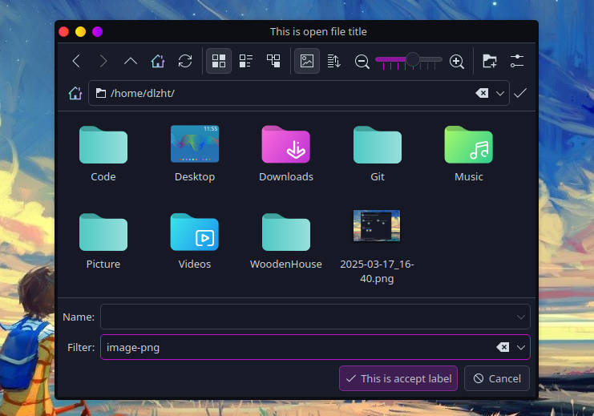
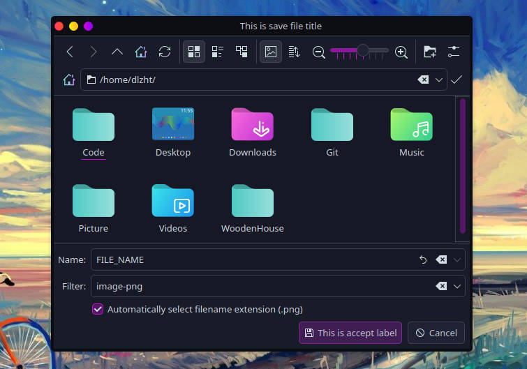
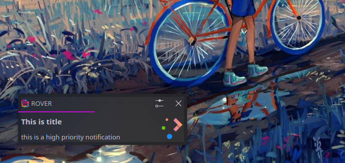
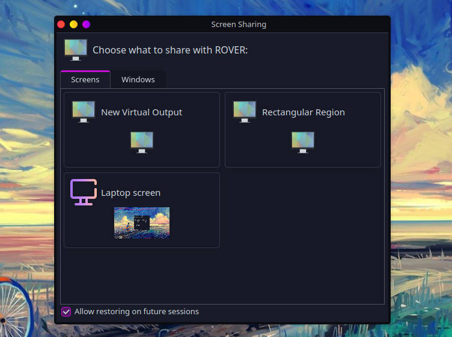
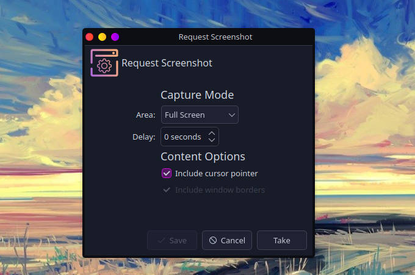

[](https://crates.io/crates/xdg-portal)
[](https://docs.rs/xdg-portal)
[](https://img.shields.io/github/license/用户名/仓库名.svg)


```toml
[dependencies]
xdg-portal = "0.1"
```

### XDG Desktop Portal
XDG Desktop Portal allow Flatpak apps, and other desktop containment frameworks, to interact with the system in a secure and well defined way.

### Features

|                       | impl | example | version    | doc                                                                                                                                        | description                                                                                                                         |
|-----------------------|--|--|------------|--------------------------------------------------------------------------------------------------------------------------------------------|-------------------------------------------------------------------------------------------------------------------------------------|
| Account               | ✅ | ✅ | 1          | [Account.xml](https://github.com/flatpak/xdg-desktop-portal/blob/main/data/org.freedesktop.portal.Account.xml)      | query basic information about the user, like their name and avatar photo                                                            |
| Background            | ❌ | ❌ | 2          | [Background.xml](https://github.com/flatpak/xdg-desktop-portal/blob/main/data/org.freedesktop.portal.Background.xml) | let application run in the background or started automatically when the user logs in                                                |
| Camera                | ✅ | ✅ | -          | [Camera.xml](https://github.com/flatpak/xdg-desktop-portal/blob/main/data/org.freedesktop.portal.Camera.xml)        | access camera devices, such as web cams                                                                                             |
| Clipboard             | ❌ | ❌ | -          | [Clipboard.xml](https://github.com/flatpak/xdg-desktop-portal/blob/main/data/org.freedesktop.portal.Clipboard.xml)  | access system clipboard                                                                                                             |
| Document              | ❌ | ❌ | 5          | [Documents.xml](https://github.com/flatpak/xdg-desktop-portal/blob/main/data/org.freedesktop.portal.Documents.xml)                                                                                                                                           | make files from the outside world available to sandboxed applications in a controlled way                                           |
| Launcher              | ❌ | ❌ | 1          | [DynamicLauncher.xml](https://github.com/flatpak/xdg-desktop-portal/blob/main/data/org.freedesktop.portal.DynamicLauncher.xml)                                                                                                                                           | instal application launchers(.desktop files) which have an icon associated with them and which execute a command in the application |
| Email                 | ✅ | ✅ | 4          | [Email.xml](https://github.com/flatpak/xdg-desktop-portal/blob/main/data/org.freedesktop.portal.Email.xml)                                                                                                                                           | request to send an email, optionally providing an address, subject, body and attachments                                            |
| File Chooser          | ✅ | ✅ | 4          | [FileChooser.xml](https://github.com/flatpak/xdg-desktop-portal/blob/main/data/org.freedesktop.portal.FileChooser.xml)                                                                                                                                           | ask the user for access to files                                                                                                    |
| File Transfer         | ❌ | ❌ | 1          | [FileTransfer.xml](https://github.com/flatpak/xdg-desktop-portal/blob/main/data/org.freedesktop.portal.FileTransfer.xml)                                                                                                                                           | transfer files between apps                                                                                                         |
| Game Mode             | ❌ | ❌ | 4          | [GameMode.xml](https://github.com/flatpak/xdg-desktop-portal/blob/main/data/org.freedesktop.portal.GameMode.xml)                                                                                                                                           | access GameMode                                                                                                                     |
| Global Shortcuts      | ❌ | ❌ | 1          | [GlobalShortcuts.xml](https://github.com/flatpak/xdg-desktop-portal/blob/main/data/org.freedesktop.portal.GlobalShortcuts.xml)                                                                                                                                           | create global shortcuts sessions, and register shortcuts                                                                            |
| Inhibit               | ❌ | ❌ | 3          | [Inhibit.xml](https://github.com/flatpak/xdg-desktop-portal/blob/main/data/org.freedesktop.portal.Inhibit.xml)                                                                                                                                           | inhibit the user session from ending, suspending, idling or getting switched away                                                   |
| Input Capture         | ❌ | ❌ | 1          | [InputCapture.xml](https://github.com/flatpak/xdg-desktop-portal/blob/main/data/org.freedesktop.portal.InputCapture.xml)                                                                                                                                           | capture input events from connected physical or logical devices                                                                     |
| Location              | ✅ | ✅ | 1          | [Location.xml](https://github.com/flatpak/xdg-desktop-portal/blob/main/data/org.freedesktop.portal.Location.xml)                                                                                                                                           | query basic information about the location                                                                                          |
| Momory Monitor        | ✅ | ✅ | 1          | [MemoryMonitor.xml](https://github.com/flatpak/xdg-desktop-portal/blob/main/data/org.freedesktop.portal.MemoryMonitor.xml)                                                                                                                                           | provides information about low system memory                                                                                        |
| Network Monitor       | ❌ | ❌ | 3          | [NetworkMonitor.xml](https://github.com/flatpak/xdg-desktop-portal/blob/main/data/org.freedesktop.portal.NetworkMonitor.xml)                                                                                                                                           | provides network status information                                                                                                 |
| Notification          | ✅ | ✅ | 2          | [Notification.xml](https://github.com/flatpak/xdg-desktop-portal/blob/main/data/org.freedesktop.portal.Notification.xml)                                                                                                                                           | send and withdraw notifications                                                                                                     |
| OpenURI               | ❌ | ❌ | 5          | [OpenURI.xml](https://github.com/flatpak/xdg-desktop-portal/blob/main/data/org.freedesktop.portal.OpenURI.xml)                                                                                                                                           | open URIs (e.g. a http: link to the applications homepage) under the control of the user                                            |
| Power Profile Monitor | ❌ | ❌ | 1          | [PowerProfileMonitor.xml](https://github.com/flatpak/xdg-desktop-portal/blob/main/data/org.freedesktop.portal.PowerProfileMonitor.xml)                                                                                                                                           | provides information about the user-selected system-wide power profile                                                              |
| Print                 | ❌ | ❌ | 3          | [Print.xml](https://github.com/flatpak/xdg-desktop-portal/blob/main/data/org.freedesktop.portal.Print.xml)                                                                                                                                           | allows applications to print                                                                                                        |
| Proxy Resolver        | ❌ | ❌ | 1          | [ProxyResolver.xml](https://github.com/flatpak/xdg-desktop-portal/blob/main/data/org.freedesktop.portal.ProxyResolver.xml)                                                                                                                                           | provides network proxy information                                                                                                  |
| Realtime              | ❌ | ❌ | 1          | [Realtime.xml](https://github.com/flatpak/xdg-desktop-portal/blob/main/data/org.freedesktop.portal.Realtime.xml)                                                                                                                                           | set threads to realtime                                                                                                             |
| Remote Desktop        | ❌ | ❌ | 2          | [RemoteDesktop.xml](https://github.com/flatpak/xdg-desktop-portal/blob/main/data/org.freedesktop.portal.RemoteDesktop.xml)                                                                                                                                           | create remote desktop sessions                                                                                                      |
| Request               | ✅ | ❌ | -          | [Request.xml](https://github.com/flatpak/xdg-desktop-portal/blob/main/data/org.freedesktop.portal.Request.xml)                                                                                                                                           | shared request interface                                                                                                            |
| Screencast            | ✅ | ✅ | 5          | [ScreenCast.xml](https://github.com/flatpak/xdg-desktop-portal/blob/main/data/org.freedesktop.portal.ScreenCast.xml)                                                                                                                                           | create screen cast sessions                                                                                                         |
| Screenshot            | ✅ | ✅ | 2          | [Screenshot.xml](https://github.com/flatpak/xdg-desktop-portal/blob/main/data/org.freedesktop.portal.Screenshot.xml)                                                                                                                                           | request a screenshot                                                                                                                |
| Secret                | ❌ | ❌ | 1          | [Secret.xml](https://github.com/flatpak/xdg-desktop-portal/blob/main/data/org.freedesktop.portal.Secret.xml)                                                                                                                                           | retrieve a per-application secret                                                                                                   |
| Session               | ❌ | ❌ | -          | [Session.xml](https://github.com/flatpak/xdg-desktop-portal/blob/main/data/org.freedesktop.portal.Session.xml)                                                                                                                                           | shared session interface                                                                                                            |
| Settings              | ❌ | ❌ | 2          | [Settings.xml](https://github.com/flatpak/xdg-desktop-portal/blob/main/data/org.freedesktop.portal.Settings.xml)                                                                                                                                           | provides read-only access to a small number of standardized host settings required for toolkits similar to XSettings                |
| Trash                 | ✅ | ✅ | 1          | [Trash.xml](https://github.com/flatpak/xdg-desktop-portal/blob/main/data/org.freedesktop.portal.Trash.xml)                                                                                                                                           | send files to the trashcan                                                                                                          |
| Usb                   | ❌ | ❌ | 1          | [Usb.xml](https://github.com/flatpak/xdg-desktop-portal/blob/main/data/org.freedesktop.portal.Usb.xml)                                                                                                                                           | monitor and request access to connected USB devices                                                                                 |
| Wallpaper             | ❌ | ❌ | 1          | [Wallpaper.xml](https://github.com/flatpak/xdg-desktop-portal/blob/main/data/org.freedesktop.portal.Wallpaper.xml)                                                                                                                                           | set the user’s desktop background picture                                                                                           |

### Example

#### 1. Account 

```rust
#[tokio::main(flavor = "current_thread")]
async fn main() {
  let portal = Portal::new().await.unwrap();
  let mut account_portal = portal.account().await.unwrap();
  let req = GetUserInfoReq::default()
    .reason("I want to get user info");
  println!("{:?}", account_portal.get_user_information(req).await);
}

// Ok(AccountUserInformation { id: "dlzht", name: "", image: "file:///home/dlzht/.face" })
```
<div align="center">
  
</div>

#### 2. Background
#### 3. Camera

```rust
#[tokio::main(flavor = "current_thread")]
async fn main() {
  let portal = Portal::new().await.unwrap();
  let camera_portal = portal.camera().await.unwrap();
  if let Ok(res) = camera_portal.is_camera_present().await && res{
    let fd = camera_portal.open_camera().await.unwrap();
    println!("Opened camera: {:?}", fd);
  }
}

// Opened camera: OwnedFd { fd: 11 }
```
#### 4. Clipboard
#### 5. Document
#### 6. Launcher
#### 7. Email

```rust
#[tokio::main(flavor = "current_thread")]
async fn main() {
  let portal = Portal::new().await.unwrap();
  let email_portal = portal.email().await.unwrap();
  let req = ComposeEmailReq::default()
    .subject("Email Subject")
    .body("Hello")
    .addresses(vec!["example@github.com".to_string()]);
  email_portal.compose_email(req).await.unwrap();
}

// mailto:example@github.com?subject=Email Subject&body=Hello
```

#### 8. File Chooser

open_file

```rust
async fn open_file() {
  let portal = Portal::new().await.unwrap();
  let mut file_chooser_portal = portal.file_chooser().await.unwrap();
  let filter1 = FileFilterReq::new("image-jpg".to_string(), vec!["*.jpg".to_string()]);
  let filter2 = FileFilterReq::new("image-png".to_string(), vec!["*.png".to_string()]);
  let filters = vec![filter1.clone(), filter2.clone()];
  let req = OpenFileReq::new()
    .title("This is open file title".to_string())
    .modal(true)
    .multiple(true)
    .filters(filters)
    .current_filter(filter2)
    .accept_label("This is accept label".to_string());
  let res = file_chooser_portal.open_file(req).await;
  println!("{:?}", res);
}

// Ok(OpenFileRes { uris: ["file:///home/dlzht/example.png"], current_filter: Some(FileFilterRes { name: "image-png", matches: ["*.png"] }) })
```

<div align="center">
  
</div>

save_file

```rust
async fn save_file() {
  let portal = Portal::new().await.unwrap();
  let mut file_chooser_portal = portal.file_chooser().await.unwrap();
  let filter1 = FileFilterReq::new("image-jpg".to_string(), vec!["*.jpg".to_string()]);
  let filter2 = FileFilterReq::new("image-png".to_string(), vec!["*.png".to_string()]);
  let filters = vec![filter1.clone(), filter2.clone()];
  let req = SaveFileReq::new()
    .title("This is save file title".to_string())
    .modal(true)
    .filters(filters)
    .current_filter(filter2)
    .current_name("FILE_NAME".to_string())
    .accept_label("This is accept label".to_string());
  let res = file_chooser_portal.save_file(req).await;
  println!("{:?}", res);
}

// Ok(SaveFileRes { uris: ["file:///home/dlzht/FILE_NAME.png"], current_filter: Some(FileFilterRes { name: "image-png", matches: ["*.png"] }) })
```

save_files(nothing happened on my machine KDE/WAYLAND)

```rust
async fn save_files() {
  let portal = Portal::new().await.unwrap();
  let mut file_chooser_portal = portal.file_chooser().await.unwrap();
  let path_buf1 = PathBuf::from("image-jpg1");
  let path_buf2 = PathBuf::from("image-jpg2");
  let req = SaveFilesReq::new()
    .title("This is save files title".to_string())
    .modal(true)
    .files(vec![path_buf1.clone(), path_buf2.clone()])
    .accept_label("This is accept label".to_string());
  let res = file_chooser_portal.save_files(req).await;
  println!("{:?}", res);
}
```

<div align="center">
  
</div>

#### 9. File Transfer
#### 10. Game Mode
#### 11. Global Shortcuts
#### 12. Inhibit
#### 13. Input Capture
#### 14. Location

```rust
#[tokio::main(flavor = "current_thread")]
async fn main() {
  let portal = Portal::new().await.unwrap();
  let location_portal = portal.location().await.unwrap();
  let req = GetLocationsReq::new();
  let mut locations = location_portal.locations(req)
    .await.unwrap();
  while let Some(location) = locations.next().await {
    println!("{:?}", location);
  }
}
```

#### 15. Memory Monitor

```rust
#[tokio::main(flavor = "current_thread")]
async fn main() {
  let portal = Portal::new().await.unwrap();
  let mut memory_monitor_portal = portal.memory_monitor().await.unwrap();
  tokio::spawn(async move {
    if let Ok(level) = memory_monitor_portal.low_memory_warning().await {

    }
  });
}
```

#### 16. Network Monitor
#### 17. Notification

```rust
#[tokio::main(flavor = "current_thread")]
async fn main() {
  let portal = Portal::new().await.unwrap();
  let notification_portal = portal.notification().await.unwrap();
  let send_req = SendNotificationReq::new()
    .id("1".to_string())
    .title("This is title".to_string())
    .body("this is a high priority notification".to_string())
    .priority(NotificationPriority::High);
  let _ = notification_portal.send_notification(send_req).await;
  tokio::time::sleep(Duration::from_millis(1000)).await;
  
  // remove notification which has id "1")
  let remove_req = RemoveNotificationReq::new("1".to_string());
  let _ = notification_portal.remove_notification(remove_req).await;
}
```
<div align="center">
  
</div>

#### 18. OpenURI
#### 19. Power Profile Monitr
#### 20. Print
#### 21. Proxy Resolver
#### 22. Realtime
#### 23. Remote Desktop
#### 24. Request
#### 25. Screencast

```rust
#[tokio::main(flavor = "current_thread")]
async fn main() {
  let portal = Portal::new().await.unwrap();
  let mut screencast_portal = portal.screencast().await.unwrap();
  let screencast_req = ScreencastReq::new()
    .source_type(SourceType::Window | SourceType::Monitor);
  let res = screencast_portal.screencast(screencast_req).await;
  println!("screencast_portal returned: {:?}", res);
}

// screencast_portal returned: Ok(ScreencastRes { streams: [SelectedSource { node_id: 73, identifier: None, source_type: SourceType(Virtual), size: Some((1920, 1080)), position: None, mapping_id: None }], fd: OwnedFd { fd: 11 } })
```
<div align="center">
  
</div>

#### 26. Screenshot

screenshot

```rust
async fn screenshot() {
  let portal = Portal::new().await.unwrap();
  let mut screenshot_portal = portal.screenshot().await.unwrap();
  let req = ScreenshotReq::new()
    .interactive(true)
    .modal(false);
  let res = screenshot_portal.screenshot(req).await;
  println!("{:?}", res);
}
// Ok(ScreenshotRes { uri: "file:///home/dlzht/Screenshot_20250321_121919.png" })
```

<div align="center">
  
</div>

pick_color

```rust
async fn pick_color() {
  let portal = Portal::new().await.unwrap();
  let mut screenshot_portal = portal.screenshot().await.unwrap();
  let req = PickColorReq::new();
  let res = screenshot_portal.pick_color(req).await;
  println!("{:?}", res);
}
// Ok(PickColorRes { r: 0.11764705926179886, g: 0.12156862765550613, b: 0.13333334028720856 })
```
#### 27. Secret
#### 28. Session
#### 29. Settings
#### 30. Trash

```rust
#[tokio::main(flavor = "current_thread")]
async fn main() {
  let portal = Portal::new().await.unwrap();
  let trash_portal = portal.trash().await.unwrap();
  let file = tokio::fs::File::open("some_file").await.unwrap();
  trash_portal.trash_file(file.as_fd()).await.unwrap();
}
```
#### 31. Usb
#### 32. Wallpaper
